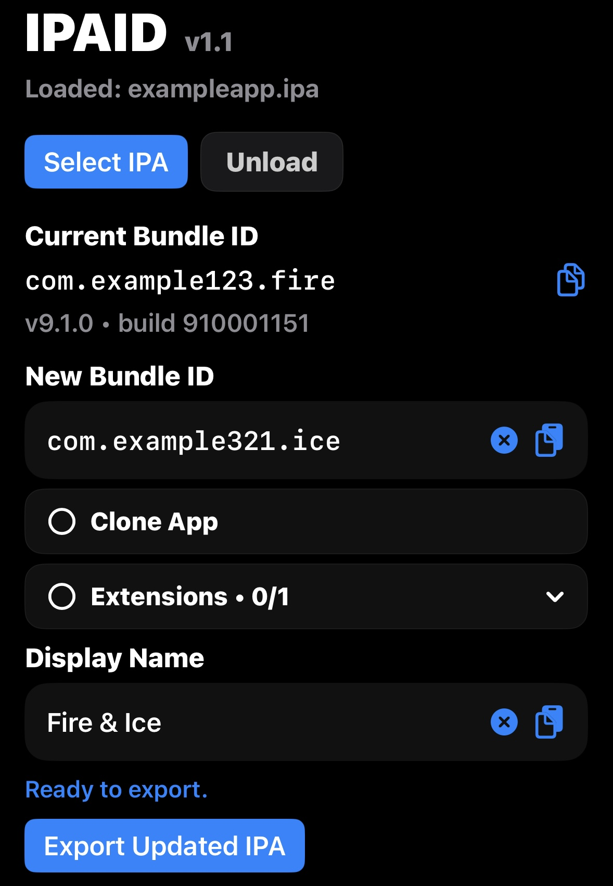

  

  
  
  

<h1 align="center">IPAID</h1>

  Lightweight IPA editor for iOS 15+

 

## Features

- Edit app bundle identifiers
- Rename apps before export
- Clone apps for side-by-side installs
- Remove unwanted app extensions
- Automatically rewrite kept extension bundle IDs
- Export updated `.ipa` files
- Keeps original IPA untouched
- Fully iPhone-native workflow
- Works before signing

 

## Example

  

 

## Why

Most iOS signing apps tie bundle identifier editing to signing workflows or certificate setup.

IPAID directly edits the IPA itself before signing it.

 

## Notes

IPAID does NOT sign apps directly.

Use:
- SideStore
- AltStore
- Feather
- LiveContainer
- TrollStore
- etc

to install/sign the exported IPA afterward.

 

## License

Licensed under MPL-2.0.
